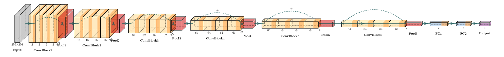

# PneuNet: Pneumonia Classification from Chest X-Rays

PneuNet is a deep learning system for detecting and classifying pneumonia types from chest X-ray images using convolutional neural networks. This project addresses a critical need for automated analysis of medical imaging to support clinical decision-making.

## The Problem: Pneumonia Diagnosis Challenges
Pneumonia causes over 2.5 million deaths annually worldwide. Key challenges include:
- Distinguishing between bacterial and viral pneumonia (critical for treatment decisions)
- High inter-class similarity in X-ray manifestations
- Time-consuming manual analysis by radiologists
- Limited access to expert diagnostics in developing regions

PneuNet automates the classification process with three distinct categories:
1. 🦠 **Bacterial Pneumonia**
2. 🩺 **Normal** 
3. 🦠 **Viral Pneumonia** 

<!-- Example X-rays for each class -->

### Example X-rays for Each Class

Below are representative X-ray images for each classification category:

1. **Bacterial Pneumonia**  


2. **Normal**  


3. **Viral Pneumonia**  


## Dataset Preparation
The model uses the [Chest X-Ray Images (Pneumonia)](https://www.kaggle.com/paultimothymooney/chest-xray-pneumonia) dataset from Kaggle, processed into three classes:

| Class               | Samples |
|---------------------|---------|
| Bacterial Pneumonia | 2780   | 
| Viral Pneumonia      | 1493   | 
| Normal              | 1583   | 

## Model Architecture

PneuNet uses a deep residual convolutional neural network (CNN) designed for robust feature extraction from chest X-ray images. The architecture consists of:

- **Residual Convolutional Blocks:**  
   Each block uses 2D convolutions with ReLU activations and includes skip connections to improve gradient flow and mitigate vanishing gradients. Pooling layers reduce spatial dimensions, enabling hierarchical feature learning.

- **L2 Regularization:**  
   Applied to the weights of the convolutional and fully connected layers to prevent overfitting and improve generalization.

- **Batch Normalization & Dropout:**  
  Applied before the fully connected layers to improve generalization and training stability.

- **Fully Connected Layers:**  
  The flattened feature map is passed through a series of dense layers, ending with a softmax output for 3-class classification (bacterial, viral, normal).

- **Cost Matrix for Loss Adjustment:**  
  To reduce false positives, a **cost matrix** is applied during the loss calculation. This matrix assigns higher penalties to specific misclassifications, such as predicting "Normal" when the actual class is "Pneumonia Bacteria" or "Pneumonia Virus." The cost matrix is defined as:
  ```python
  cost_matrix = torch.tensor([
     [0, 1, 1],  # True class: PNEUMONIA_BACTERIA
     [10, 0, 10],  # True class: NORMAL
     [1, 1, 0]   # True class: PNEUMONIA_VIRUS
  ])
  ```
  During training, the loss is scaled by the cost associated with the predicted and true classes, ensuring the model prioritizes minimizing critical errors.

- **Early Stopping:**  
  To prevent overfitting, an early stopping mechanism monitors the validation loss during training. If the validation loss does not improve for a predefined number of epochs (patience), training is halted.

- **Optimizer - AdamW:**  
  The AdamW optimizer is used for training, which combines the benefits of Adam optimization with decoupled weight decay for better generalization. The optimizer is configured with the following parameters:

- **Input:**  
  Grayscale images resized to 256x256 pixels.

- **Output:**  
  Probability scores for each class.



## Image Preprocessing Pipeline
Our preprocessing ensures optimal input for the neural network:

1. **Grayscale Conversion**  
   `transforms.Grayscale()` - Convert to single-channel images

2. **Quality Control**  
   - Remove images <256px in any dimension
   - Verify file integrity through hash checks

3. **Resizing**  
   `transforms.Resize((256, 256))` using lanczos resampling:
   ```python
   image = image.resize((img_dimension, img_dimension), Image.LANCZOS)
    ```

## Setup & Installation

1. **Clone the repository**  
   ```bash
   git clone git@github.com:lawrencefmm/PneuNet.git
   cd PneuNet
   ```

2. **Create and activate a virtual environment**  
   ```bash
   python3 -m venv env
   source env/bin/activate
   ```

3. **Install dependencies**  
   ```bash
   pip install -r requirements.txt
   ```

## Download the Kaggle Dataset

1. **Install Kaggle CLI**  
   ```bash
   pip install kaggle
   ```

2. **Get your Kaggle API token**  
   - Go to your Kaggle account settings and create a new API token.
   - Place the downloaded `kaggle.json` in `~/.kaggle/`.

3. **Download the dataset**  
   ```bash
   kaggle datasets download -d paultimothymooney/chest-xray-pneumonia
   unzip chest-xray-pneumonia.zip -d PneuNet/
   ```

## Preprocess the Data

Run the preprocessing script to prepare the dataset:
```bash
python src/preprocess.py
```

## Training the Model

Train the model using the provided training script:
```bash
python src/train_model.py
```

## Predict on a New Image

Use the `predict.py` script to predict the class of a chest X-ray image.  
Pass the image path and model checkpoint path as arguments:

```bash
python src/predict.py --image path/to/image.jpeg --model_path path/to/model.ckpt
```

- `--image`: Path to the image you want to classify.
- `--model_path`: Path to the trained model checkpoint (usually found in the `lightning_logs` directory, e.g., `lightning_logs/version_X/checkpoints/epoch=Y-step=Z.ckpt`).

The script will output the predicted class for the image.

---

# Test Results Summary

## Overall Metrics
| Metric               | Value   |
|----------------------|---------|
| **Test Accuracy**    | 0.7181  |
| **Macro Avg Precision** | 0.7580  |
| **Macro Avg Recall**    | 0.7181  |

---

## Per-Class Metrics
| Class                 | Precision | Recall   |
|-----------------------|-----------|----------|
| **PNEUMONIA_BACTERIA** | 0.7232    | 0.9040   |
| **NORMAL**             | 0.8302    | 0.9053   |
| **PNEUMONIA_VIRUS**    | 0.7207    | 0.3448   |

---

## Confusion Matrix

| Actual \ Predicted    | PNEUMONIA_BACTERIA | NORMAL | PNEUMONIA_VIRUS |
|-----------------------|--------------------:|-------:|----------------:|
| **PNEUMONIA_BACTERIA** | 358                | 12     | 26              |
| **NORMAL**             | 18                 | 220    | 5               |
| **PNEUMONIA_VIRUS**    | 119                | 33     | 80              |

---

## Training Results

The training process achieved the following results:

